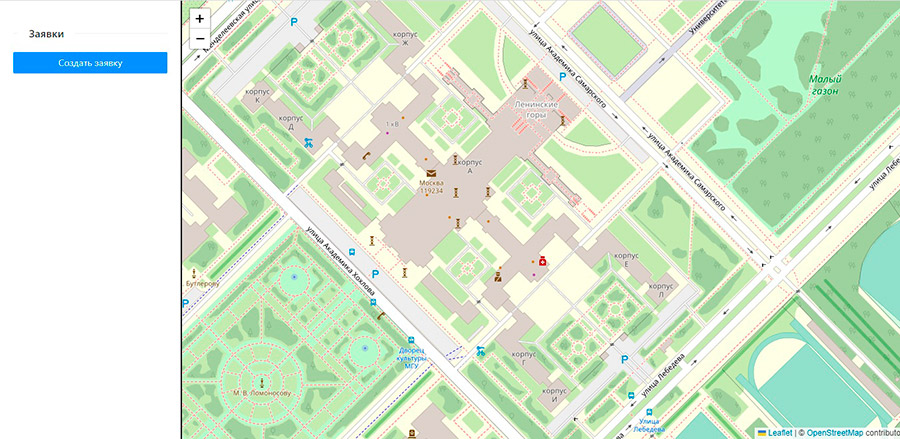
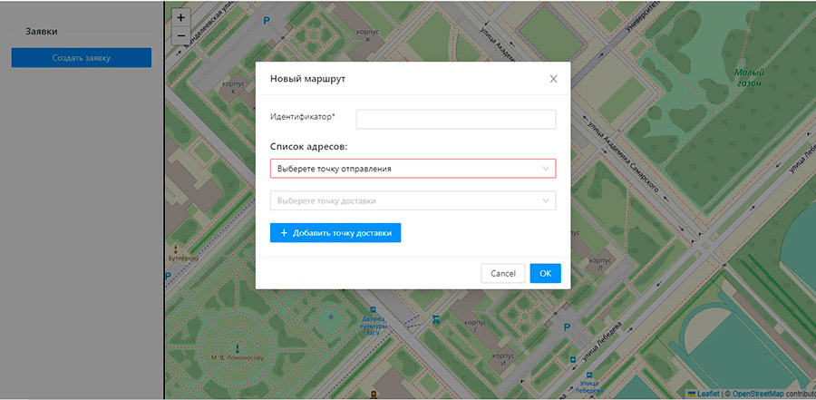
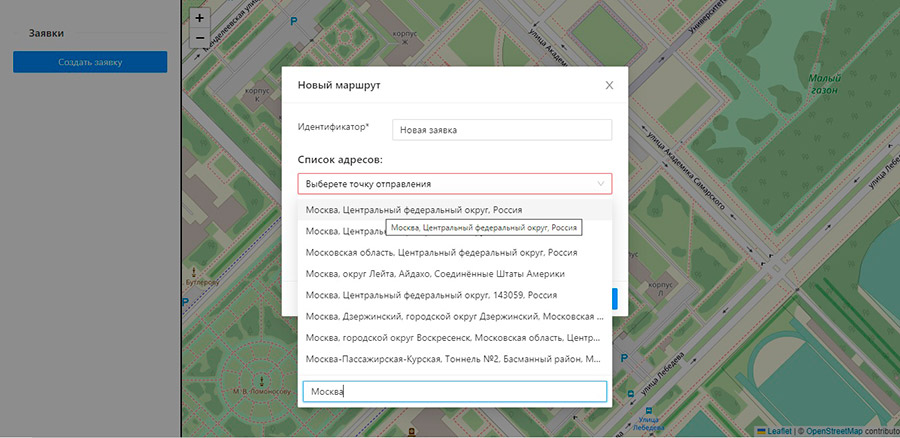
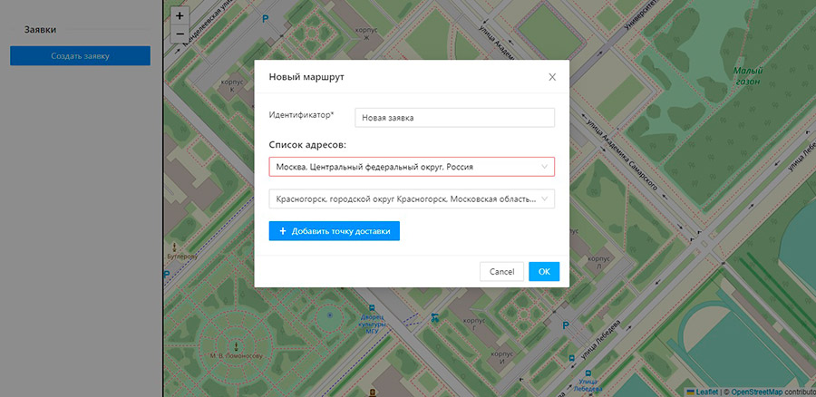
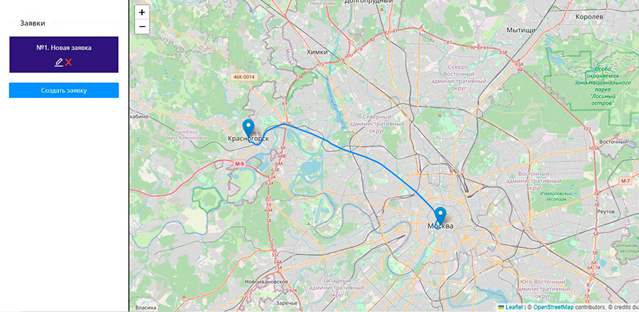

# Модуль отображения заявок на перевозку с адресами доставки

Используемые библиотеки с открытым исходным кодом:

- [ReactJS] - JavaScript-библиотека для создания пользовательских интерфейсов!
- [React - Leaflet] - Библиотека с открытым исходным кодом, написанная на JavaScript, предназначенная для отображения карт на веб-сайтах.
- [Ant Design] - Библиотека UI компонентов.
- [Axios] - Библиотека с открытым исходным кодом, позволяющая делать HTTP-запросы
- [Redux Saga] - Библиотека для JavaScript с открытым исходным кодом, предназначенная для управления состоянием приложения.

## Установка

1. Скопировать файлы в папку с программой. На компьютере обязательно должна быть установлена Node.js.
2. Открыть терминал ОС в папке с файлами и запустить команду: npm install
3. Зарегистрироваться на сайте https://openrouteservice.org/ и получить API key
4. Скопировать полученный ключ на сайте https://openrouteservice.org/ и вставить его в файл src/api/RouteApi.js под свойством "Authorization",
5. После установки набрать команду npm start, сервер должен запуститься на http://localhost:3000/

## Использование

